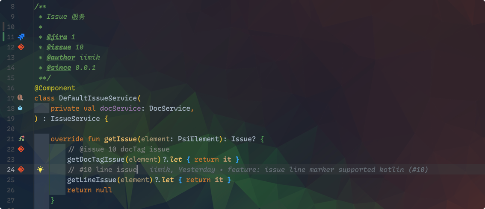

# Issue

## Issue行标记

给特定的注释添加Issue行标记。支持以下格式的注释：

* 块注释
```
/**
 * Issue 服务
 *
 * @jira 1
 * @issue 10
 * @author iimik
 * @since 0.0.1
 **/
```

* 行注释
```
// @issue 10 docTag issue
// @jira 1 docTag issue
// #10 line issue
```



## 打开 Issue

### 打开 Git Issue

### 打开 Jira
